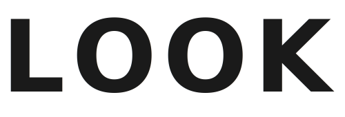

  

  
<strong>MAKEUP REFERENCE</strong>

  
<em>AI for your look</em>

  
找到和你面部结构更接近的妆容博主与男生形象参考创作者。

  

    上传一张清晰正脸照，在浏览器本地完成面部比例比较。 
    女生页面延续妆容参考，男生页面提供综合形象、发型和妆容参考；不判断身份，也不评价长相好坏。
  

  

    
    
    
    
  

  
<a href="https://makeup.soul.xn--fiqs8s/"><strong>立即体验 LOOK AI</strong></a>

---

## 怎么使用

1. 选择一张正面、无遮挡、光线均匀的照片，也可以直接拍照。
2. 等待照片质量检查和面部比例分析。
3. 在分析页右上角选择女生妆容或男生形象参考。
4. 查看面部结构更接近的创作者。
5. 无需登录，直接选择“符合”或“不太符合”，也可以分享当前结果。
6. 打开创作者主页或代表内容寻找参考。

为了让结果更稳定，建议使用自然表情、嘴唇闭合、头部摆正的照片。照片中只保留一张清晰人脸。

## 你的照片不会上传

普通用户用于匹配的照片只在当前设备处理：

- 原图不会上传或保存到服务器。
- 从照片中提取的面部比例不会上传。
- 相似度比较在浏览器本地完成。
- 关闭或刷新页面后，本次照片和分析结果不会保留。

使用过程中，应用只会从对应参考页面的公开创作者库下载已经审核通过的资料。

## 创作者申请入库

创作者可以通过“申请入库”提交：

- 博主名称
- 抖音主页
- 联系邮箱
- 一张本人授权的清晰正脸照
- 可选的代表内容
- 女生妆容或男生形象参考页面
- 形象参考、发型或妆容等内容方向

申请资料不会自动公开。我们会先核验主页归属、照片授权和内容方向，审核通过后才会加入对应的公开创作者库。

博主申请时上传的照片与普通用户的匹配照片是两条独立流程：只有博主主动提交的授权照片会上传。

## 关于匹配结果

匹配结果只表示照片中部分面部结构比例更接近，不代表身份相同，也不是审美、医学或专业化妆结论。

创作者库规模、拍摄角度、光线和表情都会影响排序。当前版本仍是验证原型，结果更适合用来发现新的妆容或男生形象参考，而不是给出唯一答案。

## 结果反馈与分享

结果页无需登录即可提交一次“符合”或“不太符合”反馈。桌面端会在浏览器本地生成并下载分享图，支持系统分享的移动设备会打开分享面板。

分享图包含用户所选照片、首选创作者照片和返回 LOOK AI 首页的二维码；本站不会保存分享内容。

为评估访问到匹配的完整漏斗，应用会按匿名浏览器标签页会话记录进入产品、选择照片、分析成功或失败、结果展示、主动反馈、点击任一创作者链接和首次成功分享。渠道归因只接受预先定义的活动编号。统计不包含照片、面部比例、匹配分数、创作者名称、具体链接或排序。

## 我们在做的事

我们正在验证一件具体的事：面部结构相近的创作者，能不能成为更有用的妆容与男生形象参考入口。

- **对普通用户**：照片和面部比例留在浏览器本地，结果用于发现参考，不做身份识别和外貌评分。
- **对博主**：只有本人或授权代表提交并完成核验的资料，才会进入匹配流程。
- **对开发者**：保持匹配方法可解释、数据边界可检查，让产品判断能够公开讨论和持续改进。

## 我们坚持的三件事

**隐私优先。** 能在设备上完成的处理，不为了省事搬到服务器。

**授权先于规模。** 博主库增长不能建立在抓取、搬运或默认同意之上。

**真实反馈先于功能数量。** 先验证匹配是否真的帮助用户，再决定下一项功能。

## 参与社区

这个项目需要三类参与者：真实使用并提供反馈的用户、愿意授权加入匹配的博主，以及帮助改进产品的开发者。

- 遇到可复现的问题：提交 [Bug 报告](https://github.com/fanshouheng/makeup-match-prototype/issues/new?template=bug_report.yml)。
- 想讨论功能和使用场景：前往 [Discussions](https://github.com/fanshouheng/makeup-match-prototype/discussions)。
- 准备贡献代码或文档：先阅读 [参与贡献](CONTRIBUTING.md) 和 [路线图](ROADMAP.md)。
- 发现安全问题：按照 [安全政策](SECURITY.md) 私下报告。
- 博主申请、撤回和删除：使用正式服务入口，不要在 GitHub 上传真人照片、邮箱或授权材料。

社区交流遵循 [行为准则](CODE_OF_CONDUCT.md)。其他问题的入口见 [支持说明](SUPPORT.md)。

## 开源许可与数据边界

本项目源代码采用 [GNU AGPL v3.0 only](LICENSE) 许可。通过网络提供修改后的版本时，也需要依照该许可向用户提供对应源代码。

开源许可只覆盖源代码，不覆盖生产环境中的博主数据库、真实照片、面部特征数据、联系信息、授权与审核资料、服务品牌或第三方内容。公开网页或接口可以访问相关资料，不表示取得抓取、复制、重建数据库或商业再利用的授权。

使用或部署前请阅读：

- [数据权利声明](DATA_RIGHTS.md)
- [服务条款](TERMS_OF_SERVICE.md)
- [完整开源许可证](LICENSE)

## 第三方字体

界面使用 HarmonyOS Sans SC 和 Space Mono。字体版权及许可条款分别保留在
[HarmonyOS Sans 字体许可](public/fonts/LICENSE-HarmonyOS-Sans.txt)和
[Space Mono 字体许可](public/fonts/LICENSE-Space-Mono.txt)中。
