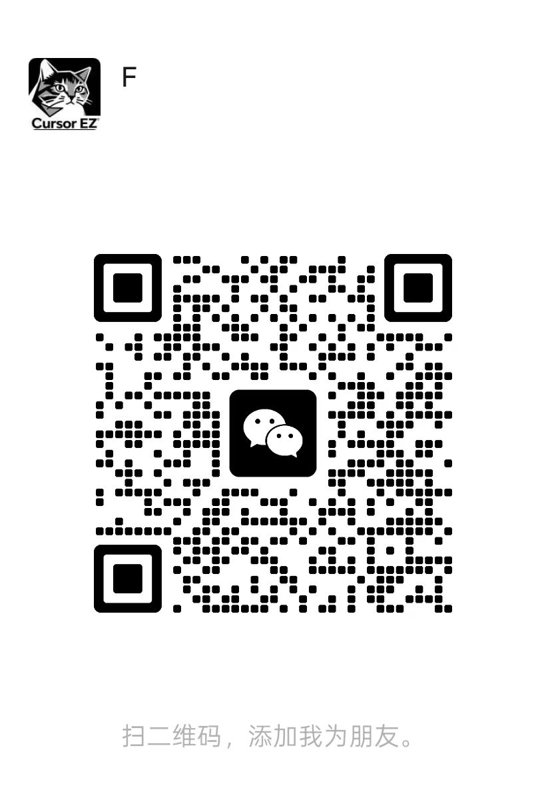

  

  
<strong>MAKEUP REFERENCE</strong>

  
<em>AI for your look</em>

  
从面部结构出发，寻找更适合参考的妆容博主。

  

    上传一张清晰正脸照，在浏览器本地完成面部比例比较。 
    当前公开页面先专注女生妆容参考；男生趣味报告入口暂时隐藏，后续将在取得博主授权后改为男生美妆博主匹配。不判断身份，也不评价长相好坏。
  

  

    
    
    
    
  

  
<a href="https://makeup.soul.xn--fiqs8s/"><strong>立即体验 MAKE UP</strong></a>

---

## 怎么使用

1. 选择一张正面、无遮挡、光线均匀的照片，也可以直接拍照。
2. 等待照片质量检查和面部比例分析。
3. 查看面部结构更接近的创作者。
4. 当前浏览器前 3 次女生成功匹配无需登录；失败或同一张已加载照片重新分析不计次数。
5. 打开创作者主页或代表内容寻找参考。
6. 注册或登录后进入 `/report` 妆容报告工作区；完整妆造报告每次消耗 100 积分。
7. 第 3 次成功匹配后可以邀请朋友；朋友确认邮箱并完成一次女生匹配后，邀请人获得 3 次新匹配和 3 积分，朋友获得 3 积分。
8. 正式目录包含单次报告、月卡和年卡：单次报告 ¥19.9 / US$2.99 到账 100 积分；月卡 ¥59 / US$8.99，每个付费账期发 1000 积分并每天刷新 50 次普通匹配；年卡 ¥599 / US$89.99，普通匹配不限次并连续 12 个月每月发 2000 积分。线上入口在订单、账期和退款技术验收完成前保持关闭。

为了让结果更稳定，建议使用自然表情、嘴唇闭合、头部摆正的照片。照片中只保留一张清晰人脸。

## 默认匹配不会上传照片

默认的已授权创作者匹配只在当前设备处理：

- 原图不会上传或保存到服务器。
- 从照片中提取的面部比例不会上传。
- 相似度比较在浏览器本地完成。
- 完成有效分析后，最近一次照片和九项面部结构数据会保存在当前浏览器；不会上传服务器，也不会跨设备同步。用户可在独立账号页清除本机档案。
- 女生流程前 3 次成功匹配按当前浏览器计数，不跨设备同步；分析失败和同一张已加载照片重新分析不计次数。次数用完后需要登录，并使用邀请获得的匹配次数，或在有效 Plus 期间不限次匹配。Plus 匹配不会消耗本机免费次数或邀请次数；普通匹配次数不单独出售。

女生匹配过程中，应用只会从公开创作者库下载已经审核通过的资料。

## 暂时隐藏的男生 AI 报告

男生趣味报告当前没有公开入口，旧实现和 `male-face-report` Edge Function 暂时保留，已有本机报告不会被删除。后续方向不是恢复评价人式报告作为主入口，而是在获得并核验足够的男生美妆博主授权后，复用本地面部比例能力提供男生美妆博主匹配。

若未来重新开放旧报告能力，仍必须遵守以下边界：

- 不发送照片、面部关键点坐标、姓名、设备标识、创作者信息或本地匹配结果。
- MAKE UP 不把精确比例、提示词或生成报告写入数据库或 Storage。
- 第三方 AI 服务负责生成文案，不负责看图或重新判断面部结构。
- Edge Function 只接受固定的九项比例、模式和评价人，并校验数值范围及 JSON 输出。
- 锐评不得使用残疾、疾病、种族、智力、性格或直接外貌羞辱；夸夸必须从比例事实出发。
- 页面明确标注 AI 生成；第三方 AI 服务仍可能依其规则处理必要的安全与运行日志。
- 男生报告沿用每个 IP 每小时最多 3 次的安全限流，数据库只保存加盐单向哈希后的限流标识。

隐藏期间不新增男生报告调用，也不接入相关支付。

## 匹配邀请与积分

每个有效邀请以“受邀账号确认邮箱，并成功完成一次女生匹配”为准，不按链接点击或单纯注册计算。邀请人获得 3 次匹配和 3 积分，受邀人获得 3 积分；邀请人每 30 天最多获得 5 位有效邀请的奖励。邀请关系和账本只保存双方账号 ID、随机邀请代码、余额变化原因和时间，不保存照片、面部比例、匹配结果、博主名字、AI 返回内容或付款凭证。

已到账积分永久有效，只用于生成完整妆造报告。单次报告购买发 100 积分；月卡发 1000 积分并每天刷新 50 次普通匹配；年卡连续 12 个月每月发 2000 积分且普通匹配不限次。普通匹配次数不单独出售。上线迁移会把执行时仍有效的旧 Plus 统一替换为 1 个月月卡并一次性发 1000 永久积分，旧 Plus 不限次匹配立即结束，原剩余期限不折算。历史积分包只做订单兼容。

原结果页的 3 积分独立 AI 博主推荐已经退役，不再提供照片上传入口，也不再接受新的服务请求。相关账本用途、匿名事件和管理台聚合仅为兼容历史记录而保留。

## MAKE UP 积分与完整妆造报告

女生妆容结果页会在免费参考完整展示后提供积分入口。完整报告包括详细面容结构报告、3 套场景妆造方案和按方案发现的公开美妆博主名字，每次消耗 100 积分。

三档随机价格、模拟配置和三种购买意向反馈已经停止，历史实验数据只在管理台保留。当前流程见 [积分与支付系统重构方案](docs/积分与支付系统重构方案.md)；旧 Plus 内测说明仅作为历史归档保留。

独立的 `/report` 页面只负责妆容报告；`/subscription` 集中展示单次报告、月卡、年卡、当前账期及 ZPAY / Stripe 支付方式；`/account` 显示账号、积分和本机报告。未登录用户可以先在本机分析照片，真正生成时仍需登录并明确导入本机资料。旧 Plus 邀请码只保留在历史兼容区；旧 `/plus` 自动转到 `/report`。价格、币种和积分由服务端目录决定；Stripe 按月卡或年卡周期续费，ZPAY 由用户主动续费。年卡首月到账 2000 积分，后续 11 次按月幂等发放，不会预发 24000 积分。支付失败不发分，重复 invoice、回调、定时任务或人工请求不重复发分，取消后已到账积分仍永久有效。管理台人工开通只处理月卡；年卡保持固定目录。生产支付入口仍须在支付安全验收并设置 `VITE_ENABLE_ONLINE_CHECKOUT=true` 后才开放。

截至 2026 年 9 月 16 日，上述 `/report`、`/subscription`、单一服务端会员目录和人工会员管理仍只在本地工作区完成；正式域名的 `/report` 与 `/subscription` 返回 404。数据库迁移、Edge Functions 和前端发布完成并经过线上验收前，不应把它们视为已上线能力。

普通账号与旧 Plus 使用同一套 Supabase Auth 登录态，密码由 Supabase Auth 认证并哈希存储，MAKE UP 业务表不保存密码明文。账号钱包保存积分余额；旧 AI 次数按 1:3、旧报告额度按 1:100 转换。最近一次有效分析和已生成报告写入浏览器 IndexedDB，并按当前用户 ID 在本机隔离。报告后台任务是临时例外：为了让用户离开页面后仍能继续生成，九项比例、场景、妆造方向和生成结果会与账号临时关联，最长不超过 24 小时；精确比例在生成结束时立即清除，报告成功写入本机后立即删除整个任务。

用户可在 `/report` 直接选择女生正脸照并由浏览器自动完成分析，再输入一个自定义使用场景、选择一个固定妆容方向，单独同意后创建后台任务；真正生成仍要求登录。登录态、积分余额、允许来源和输入结构由服务端校验，报告生成不要求 Turnstile。DeepSeek 只接收九项精确比例、场景和妆容方向；火山引擎方舟只接收场景、方向和服务端提取的固定妆容关键词。博主名字仍是未核验线索，不代表合作或授权。

`plus-makeup-report` 只接受已登录且积分足够的用户。创建任务时原子预占 100 积分，同一账号同时只允许一个处理中任务；生成失败、重试仍失败或任务过期时自动退回积分。前端每 3 秒读取一次状态，重新进入报告页也会恢复未完成任务；报告写入本机 IndexedDB 后发送确认并删除服务端副本。

## 创作者申请入库

创作者可以通过“申请入库”提交：

- 博主名称
- 主平台（抖音或小红书）及主页
- 联系邮箱
- 一张本人授权的清晰正脸照
- 可选的代表内容
- 女生妆容或男生形象参考页面
- 形象参考、发型或妆容等内容方向

申请资料不会自动公开。我们会先核验主页归属、照片授权和内容方向，审核通过后才会加入对应的公开创作者库。

博主申请照片与默认本地匹配照片是两条独立流程。博主授权照片用于审核和公开匹配；普通用户照片仍留在浏览器本地。

## 关于匹配结果

匹配结果只表示照片中部分面部结构比例更接近，不代表身份相同，也不是审美、医学或专业化妆结论。

女生创作者库规模、拍摄角度、光线和表情都会影响排序。完整妆造报告只依据九项结构比例，不能判断肤色、肤质、眼皮形态、服装或现场光线。当前版本仍是验证原型，结果只适合寻找妆容参考，不是唯一答案。

## 结果反馈与分享

结果页无需登录即可提交一次“符合”或“不符合”反馈。选择“不符合”后，需要至少选择一个固定原因，可选填写最多 160 字的“其他”原因。桌面端会在浏览器本地生成并下载分享图，支持系统分享的移动设备会打开分享面板。

分享图包含用户所选照片、首选创作者照片和返回 MAKE UP 首页的二维码；本站不会保存分享内容。

为评估访问到匹配的完整漏斗，应用会按匿名浏览器标签页会话记录进入产品、选择照片、女生模式选图、分析成功或失败、固定的失败原因分类、结果展示、主动反馈、点击任一创作者链接和首次成功分享。历史版本产生的男生模式选图事件仍保留在聚合统计中，不再从当前公开入口新增。结构化负反馈只额外保存匿名会话 ID、当次推荐过的博主 ID 无顺序集合、固定算法版本、用户选择的原因、可选的“其他”短文本和服务端时间。已经结束的 Plus 意向实验历史数据只包含曝光、展开、配置完成、三种意向反馈、固定价格分组、匿名会话标识和时间；当前结果页不再发送这些 Plus 实验事件。渠道归因只接受预先定义的活动编号。统计与负反馈都不包含照片、面部比例、匹配分数、设备身份、创作者名称、具体链接或推荐名次。

## 我们在做的事

我们当前验证两件事：面部结构相近的创作者能否成为更有用的女生妆容参考入口，以及用户是否愿意按月订阅并使用每月积分完成场景妆造报告。男生方向先积累已授权的美妆博主，再决定匹配验证。

- **对普通用户**：默认匹配的照片和面部比例留在浏览器本地；当前浏览器前 3 次女生成功匹配无需登录，后续可通过邀请免费解锁。完整报告按积分使用，仍需另行说明并取得同意，不做身份识别和外貌评分。
- **对博主**：只有本人或授权代表提交并完成核验的资料，才会进入匹配流程。
- **对开发者**：保持匹配方法可解释、数据边界可检查，让产品判断能够公开讨论和持续改进。

## 我们坚持的三件事

**隐私优先。** 能在设备上完成的处理，不为了省事搬到服务器。

**授权先于规模。** 博主库增长不能建立在抓取、搬运或默认同意之上。

**真实反馈先于功能数量。** 先验证匹配是否真的帮助用户，再决定下一项功能。

## 联系作者与参与社区

这个项目需要三类参与者：真实使用并提供反馈的用户、愿意授权加入匹配的博主，以及帮助改进产品的开发者。

微信群二维码有效期较短，GitHub 不再把群二维码作为长期联系入口。欢迎扫码添加作者微信，备注“MAKE UP”，反馈真实使用感受、申请加入交流群或交流项目。

作者个人自媒体记录 AI 小产品从想法、开发到上线验证的过程，与 MAKE UP 产品官方账号分开：

- [小红书：koten（小红书号 5512099838）](https://www.xiaohongshu.com/user/profile/64a7b0c1000000000b014d07)
- [抖音：ai shandong（抖音号 1259791158）](https://www.douyin.com/user/MS4wLjABAAAA8EsCkkVc2Pqmg1d2WrF2I1_Zp-6-6BWM8BdVjK_0_Gc)

- 遇到可复现的问题：提交 [Bug 报告](https://github.com/fanshouheng/makeup-match-prototype/issues/new?template=bug_report.yml)。
- 想讨论功能和使用场景：前往 [Discussions](https://github.com/fanshouheng/makeup-match-prototype/discussions)。
- 准备贡献代码或文档：先阅读 [参与贡献](CONTRIBUTING.md) 和 [路线图](ROADMAP.md)。
- 发现安全问题：按照 [安全政策](SECURITY.md) 私下报告。
- 博主申请、撤回和删除：使用正式服务入口，不要在 GitHub 上传真人照片、邮箱或授权材料。

社区交流遵循 [行为准则](CODE_OF_CONDUCT.md)。其他问题的入口见 [支持说明](SUPPORT.md)。

## 开源许可与数据边界

本项目源代码采用 [GNU AGPL v3.0 only](LICENSE) 许可。通过网络提供修改后的版本时，也需要依照该许可向用户提供对应源代码。

开源许可只覆盖源代码，不覆盖生产环境中的博主数据库、真实照片、面部特征数据、联系信息、授权与审核资料、服务品牌或第三方内容。公开网页或接口可以访问相关资料，不表示取得抓取、复制、重建数据库或商业再利用的授权。

使用或部署前请阅读：

- [数据权利声明](DATA_RIGHTS.md)
- [服务条款](TERMS_OF_SERVICE.md)
- [完整开源许可证](LICENSE)

## 第三方字体

界面使用 HarmonyOS Sans SC 和 Space Mono。字体版权及许可条款分别保留在
[HarmonyOS Sans 字体许可](public/fonts/LICENSE-HarmonyOS-Sans.txt)和
[Space Mono 字体许可](public/fonts/LICENSE-Space-Mono.txt)中。
